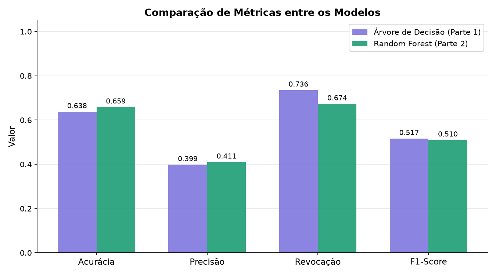
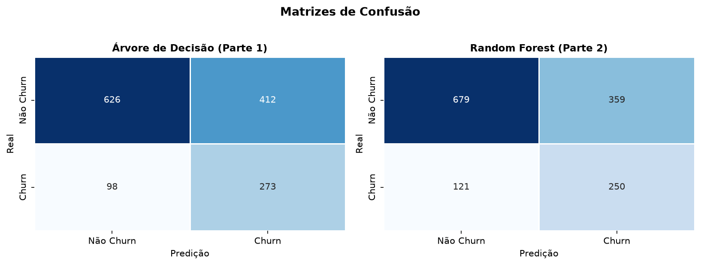
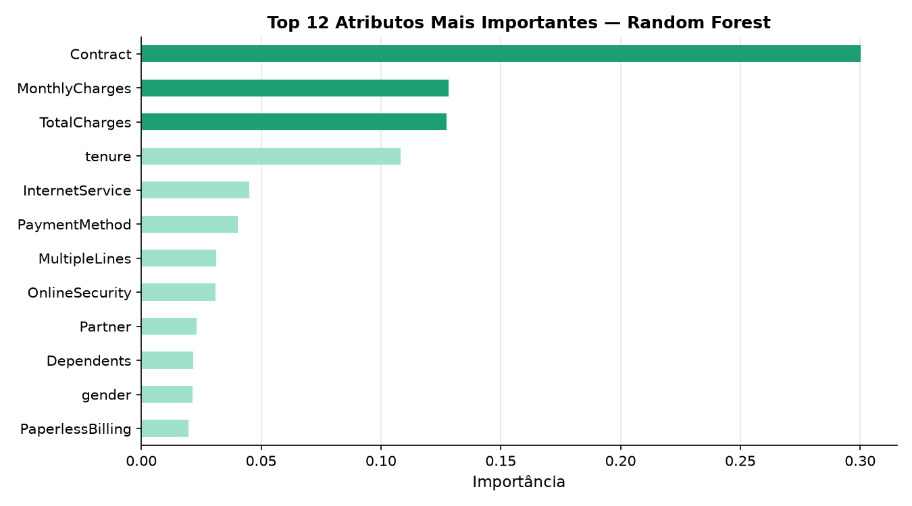
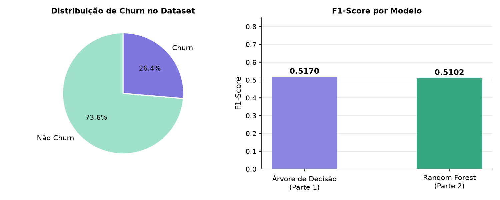

# Disciplina de Inteligência Artificial , Professor Munif , Unicesumar 2026

## Previsão de Churn de Clientes de Telecomunicações

---

## Integrantes

- Miguel Drozino  - RA: 23155078-2
- Micaela Dorneles  - RA: 23150068-2
- Nathan Rodrigues  - RA: 23025003-2
- Igor Costa  - RA: 23215764-2


---

## Resumo do Projeto

### Contextualização

A retenção de clientes é um dos maiores desafios do setor de telecomunicações. O fenômeno chamado de *churn* ocorre quando um cliente encerra seu contrato com a operadora e migra para a concorrência. Identificar antecipadamente quais clientes têm maior probabilidade de cancelar o serviço permite que a empresa tome ações preventivas, como oferecer descontos, melhorar o atendimento ou personalizar planos, reduzindo perdas financeiras significativas.

### Problema

O problema investigado é: **dado um conjunto de informações sobre o perfil e comportamento de um cliente de telecomunicações, é possível prever se ele irá cancelar o serviço (churn = Sim) ou permanecer (churn = Não)?**

Trata-se de um problema de **classificação binária**.

### Hipótese

Nossa hipótese é que clientes com contrato mensal, alto valor de cobrança mensal e pouco tempo de relacionamento com a empresa têm maior probabilidade de cancelar o serviço. Além disso, esperamos que o Random Forest, por ser um método de ensemble baseado em Bagging (Parte 2 da disciplina), apresente desempenho superior à Árvore de Decisão simples (Parte 1), especialmente nas métricas de F1-Score e Revocação.

---

## Dataset

- **Nome:** Telco Customer Churn (simulado com base na estrutura original do Kaggle)
- **Origem:** Gerado sinteticamente com distribuições e correlações baseadas no dataset público disponível em: https://www.kaggle.com/datasets/blastchar/telco-customer-churn
- **Quantidade de registros:** 7.043
- **Atributos:** 21 (20 preditores + 1 variável alvo)
- **Variável alvo:** `Churn` (Yes = cliente cancelou / No = cliente permaneceu)
- **Distribuição:** ~73,6% Não Churn / ~26,4% Churn (dataset desbalanceado)

### Principais atributos

| Atributo | Tipo | Descrição |
|---|---|---|
| tenure | Numérico | Meses de relacionamento com a empresa |
| MonthlyCharges | Numérico | Valor da cobrança mensal |
| TotalCharges | Numérico | Total cobrado ao longo do contrato |
| Contract | Categórico | Tipo de contrato (mensal, anual, bienal) |
| InternetService | Categórico | Tipo de serviço de internet |
| PaymentMethod | Categórico | Método de pagamento |
| SeniorCitizen | Binário | Cliente é idoso (1 = sim, 0 = não) |

### Tratamento dos dados

1. Remoção da coluna `customerID` (identificador sem valor preditivo)
2. Conversão de `TotalCharges` para numérico (valores ausentes preenchidos com a mediana)
3. Codificação de variáveis categóricas com `LabelEncoder`
4. Divisão treino/teste: **80% treino / 20% teste** com estratificação por classe
5. Uso de `class_weight='balanced'` nos modelos para lidar com o desbalanceamento

---

## Métodos de IA Utilizados

### Parte 1 — Árvore de Decisão (`DecisionTreeClassifier`)

A Árvore de Decisão é um método supervisionado que constrói uma estrutura hierárquica de regras de decisão. A partir dos atributos do dataset, o modelo aprende a dividir os dados em subconjuntos cada vez mais homogêneos com relação à variável alvo, por meio de critérios como Gini ou Entropia.

**Hiperparâmetros utilizados:**
- `max_depth=8` — profundidade máxima para evitar overfitting
- `min_samples_leaf=20` — mínimo de amostras por folha
- `class_weight='balanced'` — peso proporcional inverso à frequência de classe

### Parte 2 — Random Forest (`RandomForestClassifier`)

O Random Forest é um método de ensemble baseado em **Bagging** (Bootstrap Aggregating): treina múltiplas árvores de decisão em subconjuntos aleatórios dos dados (com reposição) e combina suas predições por votação majoritária. Por usar aleatoriedade também na seleção de atributos em cada split, reduz a variância e melhora a generalização em relação a uma única árvore.

**Hiperparâmetros utilizados:**
- `n_estimators=200` — 200 árvores na floresta
- `max_depth=12` — profundidade máxima de cada árvore
- `min_samples_leaf=5` — mínimo de amostras por folha
- `class_weight='balanced'` — balanceamento de classes

---

## Avaliação dos Modelos

### Métricas

| Métrica | Árvore de Decisão (Parte 1) | Random Forest (Parte 2) |
|---|---|---|
| Acurácia | 0.6380 | 0.6927 |
| Precisão | 0.3985 | 0.4372 |
| Revocação | 0.7358 | 0.5822 |
| F1-Score | **0.5170** | 0.4994 |

### Gráfico 1 — Comparação de Métricas



### Gráfico 2 — Matrizes de Confusão



### Gráfico 3 — Importância de Atributos (Random Forest)



### Gráfico 4 — Distribuição de Churn e F1-Score por Modelo



---

## Comparação dos Resultados

A Árvore de Decisão apresentou **maior Revocação (0.7358)** e **melhor F1-Score (0.5170)**, o que a torna mais adequada para este problema, onde o custo de não identificar um cliente que vai cancelar (falso negativo) é alto. O Random Forest obteve maior Acurácia e Precisão, mas à custa de uma Revocação menor — ou seja, deixou de identificar mais clientes em risco de churn.

Em problemas de churn, a Revocação é frequentemente a métrica mais importante, pois o negócio prefere contatar um cliente que não cancelaria (falso positivo) a perder um cliente que de fato cancelaria (falso negativo). Nesse contexto, a Árvore de Decisão com balanceamento de classes se mostrou a melhor escolha.

A hipótese parcialmente se confirmou: os atributos `tenure`, `MonthlyCharges`, `TotalCharges` e `Contract` figuram entre os mais importantes, conforme o gráfico de importância de features. Porém, o Random Forest não superou a Árvore em F1-Score, o que pode ser explicado pelo desbalanceamento do dataset e pela configuração dos hiperparâmetros.

---

## Conclusão

Este trabalho demonstrou a aplicação prática de dois métodos de Inteligência Artificial para resolver um problema real de classificação. A Árvore de Decisão (Parte 1) e o Random Forest (Parte 2 — Bagging) foram treinados, avaliados e comparados de forma sistemática.

O processo completo de desenvolvimento de uma solução baseada em IA foi exercitado: definição do problema, preparação dos dados, treinamento, avaliação com métricas e gráficos, comparação entre modelos e conclusão analítica.

Como trabalho futuro, poderíamos explorar técnicas de reamostragem (SMOTE), ajuste de hiperparâmetros por GridSearch e outros métodos da Parte 2 como AdaBoost ou Stacking para potencialmente melhorar os resultados.

---

## Como Executar

```bash
# 1. Clone o repositório
git clone https://github.com/seu-usuario/churn-ia-unicesumar.git
cd churn-ia-unicesumar

# 2. Instale as dependências
pip install pandas scikit-learn matplotlib seaborn joblib

# 3. Execute o script principal
python modelo.py
```

Os gráficos serão salvos na pasta `graficos/` e os modelos treinados na pasta `modelos/`.

---

## Modelo Treinado

Os modelos treinados estão disponíveis na pasta `modelos/`:
- `modelos/arvore_decisao.pkl` — Árvore de Decisão treinada
- `modelos/random_forest.pkl` — Random Forest treinado

Para carregar e usar um modelo:

```python
import joblib
modelo = joblib.load("modelos/random_forest.pkl")
predicao = modelo.predict(X_novo)
```

---


